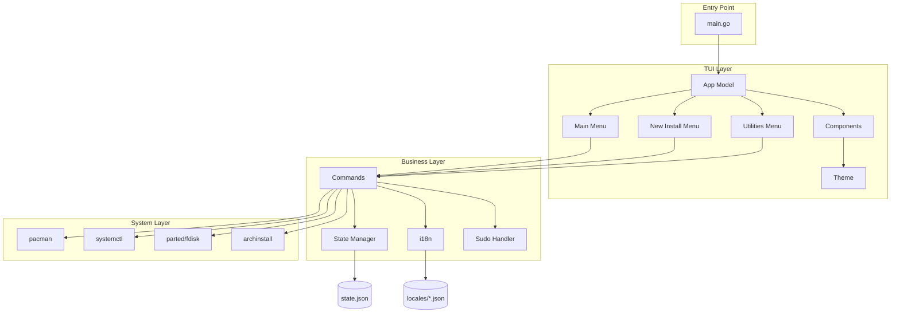
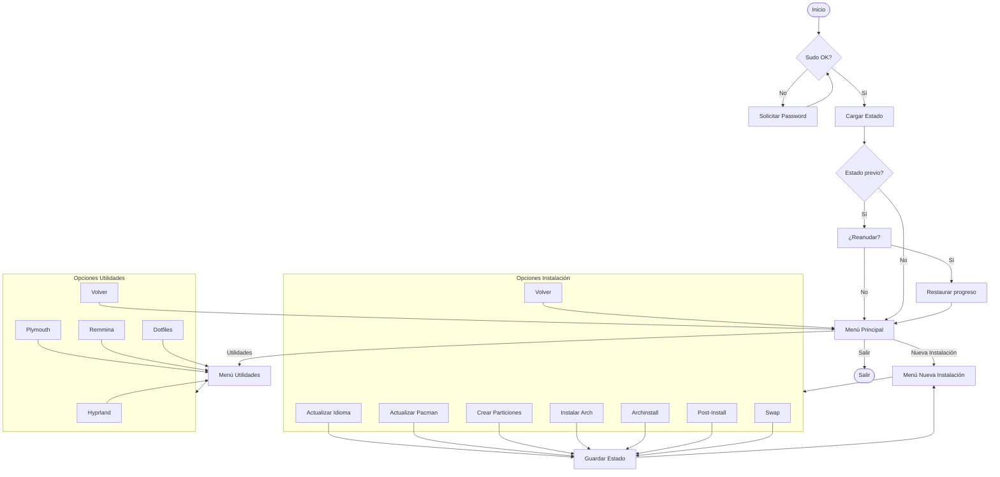
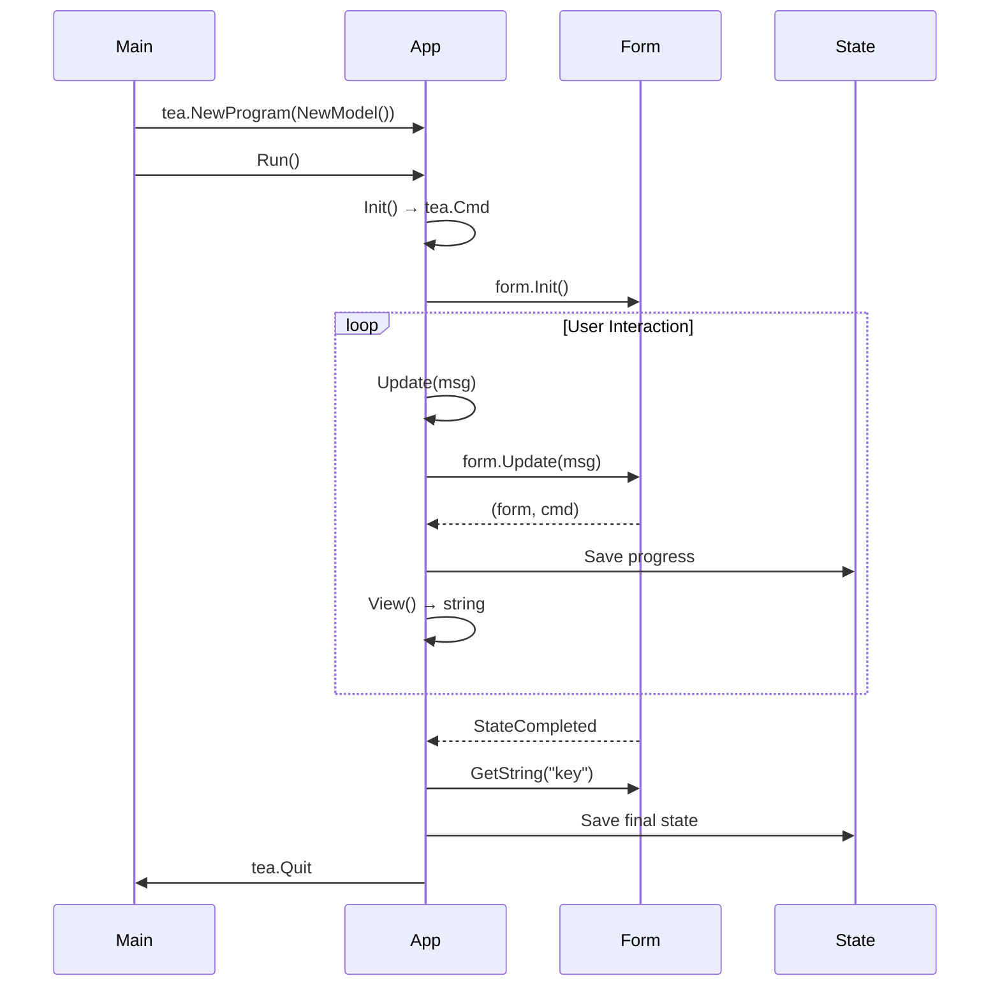
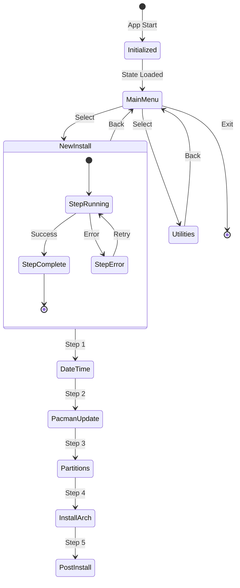

# Plan de Migración: Gum (Bash) → Bubble Tea + Huh (Go)

## TL;DR

> **Quick Summary**: Migrar 15 scripts Bash (1988 líneas) usando gum a una aplicación Go con Bubble Tea + Huh para formularios TUI de instalación de Arch Linux.
> 
> **Deliverables**:
> - Aplicación Go compilable como binario estático único
> - Soporte multi-idioma (Español/Inglés)
> - Persistencia de estado para instalaciones interrumpidas
> - Tests unitarios con cobertura >80%
> 
> **Estimated Effort**: Large (8-12 semanas)
> **Parallel Execution**: YES - 5 waves con 5-7 tasks cada una
> **Critical Path**: Project Setup → Core Infrastructure → Menu System → Modules → Integration

---

## Context

### Original Request
Migrar los scripts Bash actuales que usan `gum` a una aplicación Go usando **Bubble Tea + Huh** para formularios TUI más sofisticados, siguiendo el patrón Model/Update/View del ejemplo proporcionado.

### Interview Summary
**Key Discussions**:
- **Reemplazo completo**: No mantener scripts Bash como fallback
- **Multi-idioma**: Soporte para Español e Inglés (i18n)
- **Persistencia**: Guardar estado para reanudar instalaciones interrumpidas
- **Tests**: Cobertura unitaria completa >80%

**Research Findings**:
- Bubble Tea: Framework TUI con patrón Elm (Model/Update/View)
- Huh: Librería de formularios con Input, Select, Confirm, MultiSelect
- Bubbles: Componentes adicionales (spinner, viewport, textinput)
- Lipgloss: Sistema de estilos para theming

### Metis Review - Critical Gaps Addressed

**Gap 1: Gum Feature Gap** (RESUELTO)
- `gum filter` → Usar `bubbles/textinput` con filtrado manual
- `gum file` → Usar `bubbles/filepicker`
- `gum spinner` → Usar `bubbles/spinner`
- `gum table` → Usar `bubbles/table`

**Gap 2: Privilege Escalation** (RESUELTO)
- Solicitar sudo al inicio con `sudo -S`
- Mantener sesión activa durante toda la ejecución
- Error claro si sudo falla

**Gap 3: Testing Strategy** (RESUELTO)
- Tests programáticos para lógica de negocio
- Golden files para output de View() (sin ANSI codes)
- Mock de os/exec para comandos del sistema
- Target: 80% cobertura de statements

**Gap 4: Feature Parity Scope** (RESUELTO)
- Migrar TODAS las features user-facing
- Manejar errores comunes (network fail, disk full)
- Comportamiento idéntico a scripts Bash

---

## Work Objectives

### Core Objective
Crear una aplicación Go TUI completa que reemplace los 15 scripts Bash de instalación de Arch Linux, manteniendo funcionalidad 1:1 con mejor UX y mantenibilidad.

### Concrete Deliverables
- `cmd/arch-installer/main.go` - Entry point
- `tui/` - Sistema TUI completo con menús y formularios
- `internal/commands/` - Ejecutores de comandos del sistema
- `internal/i18n/` - Sistema de traducciones
- `internal/state/` - Persistencia de estado
- `configs/` - Configuraciones existentes
- Tests con cobertura >80%

### Definition of Done
- [ ] Todos los menús funcionales con Huh forms
- [ ] Multi-idioma ES/EN funcionando
- [ ] Estado guardado en `~/.config/arch-installer/state.json`
- [ ] `go test ./...` pasa con cobertura >80%
- [ ] `go build -ldflags="-s -w"` produce binario <30MB
- [ ] Binario funciona en Arch Linux Live ISO

### Must Have
- Menú principal con navegación completa
- Todos los módulos de new_install migrados
- Todos los módulos de utilities migrados
- Soporte ES/EN para todos los textos
- Persistencia de estado entre ejecuciones
- Tests unitarios con mocks

### Must NOT Have (Guardrails)
- ❌ Nuevas features no existentes en Bash scripts
- ❌ Más de 3 librerías TUI (solo bubbletea + huh + bubbles)
- ❌ Base de datos (solo JSON file)
- ❌ Goroutines para operaciones async (Bubble Tea es síncrono)
- ❌ Polkit para privilegios (usar sudo simple)
- ❌ E2E tests (requiere Arch Linux completo)

---

## Verification Strategy (MANDATORY)

> **ZERO HUMAN INTERVENTION** — ALL verification is agent-executed.

### Test Decision
- **Infrastructure exists**: NO (crear desde cero)
- **Automated tests**: YES (TDD para cada módulo)
- **Framework**: `testing` package + `testify` + `gomock`
- **Pattern**: RED (failing test) → GREEN (minimal impl) → REFACTOR

### QA Policy
Every task includes agent-executed QA scenarios with evidence capture.
Evidence saved to `.sisyphus/evidence/task-{N}-{scenario-slug}.{ext}`.

- **TUI Components**: `teatest` para simulación de interacciones
- **Commands**: Mock de `os/exec` con interfaces
- **State**: Tests de serialización/deserialización JSON
- **i18n**: Tests de traducción completa

---

## Architecture

### Directory Structure

```
arch-installer/
├── cmd/
│   └── arch-installer/
│       └── main.go                    # Entry point, flags, initialization
├── tui/
│   ├── app.go                         # Modelo principal (tea.Model)
│   ├── screens/
│   │   ├── main_menu.go               # Pantalla menú principal
│   │   ├── new_install/
│   │   │   ├── menu.go                # Menú instalación
│   │   │   ├── date_time.go           # Configuración fecha/hora
│   │   │   ├── pacman_update.go       # Actualización pacman
│   │   │   ├── partitions.go          # Particionamiento
│   │   │   ├── install_arch.go        # Instalación base
│   │   │   ├── install_archinstall.go # Usando archinstall
│   │   │   ├── post_install.go        # Post-instalación
│   │   │   └── swap.go                # Configuración swap
│   │   └── utilities/
│   │       ├── menu.go                # Menú utilidades
│   │       ├── hyprland.go            # Setup Hyprland
│   │       ├── plymouth.go            # Setup Plymouth
│   │       ├── remmina.go             # Setup Remmina
│   │       └── dotfiles.go            # Gestión dotfiles
│   ├── components/
│   │   ├── logo.go                    # Logo Arch Linux
│   │   ├── menu.go                    # Menú reutilizable
│   │   ├── confirm.go                 # Confirmación reutilizable
│   │   ├── spinner.go                 # Spinner de progreso
│   │   └── error_dialog.go            # Diálogo de errores
│   └── theme/
│       └── arch.go                    # Tema Arch Linux (cyan/blue/white)
├── internal/
│   ├── commands/
│   │   ├── executor.go                # Interface para comandos
│   │   ├── pacman.go                  # Comandos pacman
│   │   ├── systemctl.go               # Comandos systemctl
│   │   ├── partition.go               # Comandos de particionado
│   │   ├── archinstall.go             # Wrapper archinstall
│   │   └── network.go                 # Comandos de red
│   ├── state/
│   │   ├── state.go                   # Estado de la aplicación
│   │   ├── persistence.go             # Guardar/cargar estado
│   │   └── migration.go               # Migración de versiones
│   ├── i18n/
│   │   ├── i18n.go                    # Sistema de traducciones
│   │   ├── locales/
│   │   │   ├── en.json                # Traducciones inglés
│   │   │   └── es.json                # Traducciones español
│   │   └── loader.go                  # Cargador de locales
│   ├── config/
│   │   └── config.go                  # Configuración global
│   └── sudo/
│       └── sudo.go                    # Manejo de privilegios
├── configs/
│   ├── user_credentials.json          # Existente
│   └── user_configuration.json        # Existente
├── test/
│   ├── mocks/
│   │   └── executor_mock.go           # Mock del executor
│   └── golden/
│       └── *.golden                   # Golden files para View()
├── go.mod
├── go.sum
├── Makefile
└── README.md
```

### Gum → Huh/Bubbles Mapping

| Gum Command | Current Usage | Go Equivalent | Complexity |
|-------------|---------------|---------------|------------|
| `gum choose` | Menús de selección | `huh.NewSelect[T]()` | Low |
| `gum confirm` | Confirmaciones sí/no | `huh.NewConfirm()` | Low |
| `gum input` | Entradas de texto | `huh.NewInput()` | Low |
| `gum input --password` | Passwords | `huh.NewInput().Password()` | Low |
| `gum style` | Estilos/logos | `lipgloss.Style` | Low |
| `gum spin` | Progreso async | `bubbles/spinner` | Medium |
| `gum filter` | Búsqueda fuzzy | `bubbles/textinput` + filter | Medium |
| `gum file` | Selector archivos | `bubbles/filepicker` | Medium |
| `gum table` | Tablas formateadas | `bubbles/table` | Medium |

### Mermaid Diagrams

#### 1. System Architecture



#### 2. TUI Flow Diagram



#### 3. Bubble Tea Model Lifecycle



#### 4. Module Flow - New Installation

```mermaid
flowchart LR
    subgraph "Module: date_time_zone"
        DT1[Select Timezone]
        DT2[Select Locale]
        DT3[Apply Settings]
    end
    
    subgraph "Module: pacman_update"
        PU1[Update Mirrors]
        PU2[Update Packages]
    end
    
    subgraph "Module: partitions"
        P1[Select Disk]
        P2[Select Scheme]
        P3[Create Partitions]
        P4[Format Partitions]
    end
    
    subgraph "Module: install_arch"
        IA1[Pacstrap Base]
        IA2[Generate Fstab]
        IA3[Post Install Script]
    end
    
    DT1 --> DT2 --> DT3
    PU1 --> PU2
    P1 --> P2 --> P3 --> P4
    IA1 --> IA2 --> IA3
    
    DT3 --> PU1
    PU2 --> P1
    P4 --> IA1
```



#### 5. State Management Flow



---

## Execution Strategy

### Parallel Execution Waves

```
Wave 1 (Foundation - 7 tasks parallel):
├── T1: Project scaffolding (go mod, Makefile)
├── T2: Theme system (lipgloss, Arch colors)
├── T3: State management (JSON persistence)
├── T4: i18n system (go-i18n setup)
├── T5: Sudo handler (privilege management)
├── T6: Command executor interface
└── T7: Test infrastructure setup

Wave 2 (Core TUI - 7 tasks parallel):
├── T8: Main App Model (tea.Model)
├── T9: Logo component
├── T10: Menu component (reusable)
├── T11: Confirm component (reusable)
├── T12: Spinner component
├── T13: Error dialog component
└── T14: Main menu screen

Wave 3 (New Install Modules - 7 tasks parallel):
├── T15: New Install menu screen
├── T16: date_time_zone module
├── T17: pacman_update module
├── T18: partitions module
├── T19: install_arch module
├── T20: archinstall module
└── T21: post_install module

Wave 4 (Utilities + Integration - 6 tasks parallel):
├── T22: Utilities menu screen
├── T23: hyprland module
├── T24: plymouth module
├── T25: remmina module
├── T26: dotfiles module
└── T27: swap module

Wave 5 (Testing + Polish - 5 tasks parallel):
├── T28: Integration tests
├── T29: i18n complete translations
├── T30: Error handling comprehensive
├── T31: Binary build optimization
└── T32: Documentation

Critical Path: T1 → T8 → T14 → T15 → T19 → T28
```

### Dependency Matrix

| Task | Depends On | Blocks |
|------|------------|--------|
| T1-T7 | — | T8-T32 |
| T8 | T1, T2, T3 | T14-T15 |
| T9-T13 | T2 | T14-T27 |
| T14 | T8, T9, T10 | T15, T22 |
| T15 | T14 | T16-T21 |
| T16-T21 | T3, T4, T5, T6, T15 | T28 |
| T22 | T14 | T23-T26 |
| T23-T27 | T3, T5, T6, T22 | T28 |
| T28 | T16-T27 | T31 |
| T29 | T4 | T31 |
| T30 | T12 | T31 |
| T31 | T28, T29, T30 | T32 |
| T32 | T31 | — |

---

## TODOs

> Implementation + Test = ONE Task. Never separate.
> EVERY task MUST have: Recommended Agent Profile + Parallelization info + QA Scenarios.

---

### WAVE 1: Foundation (7 tasks - MAX PARALLEL)

- [ ] 1. Project Scaffolding + Go Module Setup

  **What to do**:
  - Initialize Go module: `go mod init github.com/user/arch-installer`
  - Create directory structure as defined in Architecture section
  - Add Makefile with targets: build, test, clean, install
  - Add .gitignore for Go projects
  - Create main.go skeleton with cobra flags (--lang, --resume, --version)

  **Must NOT do**:
  - No business logic yet (only scaffolding)
  - No external dependencies yet (only go.mod init)

  **Recommended Agent Profile**:
  - **Category**: `quick`
  - **Skills**: []
    - Simple project setup, no special skills needed

  **Parallelization**:
  - **Can Run In Parallel**: YES
  - **Parallel Group**: Wave 1 (with T2-T7)
  - **Blocks**: T8, T28
  - **Blocked By**: None (can start immediately)

  **References**:
  - Go modules: `go help mod init`
  - Makefile patterns: `/workspace/Makefile` (if exists) or standard Go Makefile

  **Acceptance Criteria**:
  - [ ] `go mod init` completed: `test -f go.mod`
  - [ ] All directories created: `ls cmd/ tui/ internal/`
  - [ ] Makefile exists: `test -f Makefile`
  - [ ] `make build` produces binary: `make build && test -f arch-installer`

  **QA Scenarios**:
  ```
  Scenario: Build succeeds
    Tool: Bash
    Steps:
      1. go mod download
      2. go build -o arch-installer ./cmd/arch-installer
      3. ./arch-installer --version
    Expected Result: Binary exists and shows version
    Evidence: .sisyphus/evidence/task-01-build.log
  ```

  **Commit**: YES
  - Message: `chore: initialize Go module and project structure`
  - Files: `go.mod, go.sum, Makefile, .gitignore, cmd/arch-installer/main.go`

- [ ] 2. Theme System (Lipgloss + Arch Colors)

  **What to do**:
  - Create `tui/theme/arch.go` with Arch Linux color palette
  - Define colors: HEX_ARCH_BLUE (#1793D1), HEX_ARCH_CYAN (#00FFFF), HEX_ARCH_WHITE (#FFFFFF)
  - Define styles for: title, subtitle, menu item, selected item, error, success
  - Create `BaseTheme()` function returning `*huh.Theme` for Huh forms
  - Add styles for logo rendering

  **Must NOT do**:
  - No component-specific styles (only theme constants)
  - No runtime color detection

  **Recommended Agent Profile**:
  - **Category**: `quick`
  - **Skills**: []
    - Simple constant definitions, no special skills

  **Parallelization**:
  - **Can Run In Parallel**: YES
  - **Parallel Group**: Wave 1 (with T1, T3-T7)
  - **Blocks**: T9-T13 (components need theme)
  - **Blocked By**: T1 (project structure)

  **References**:
  - Gum colors: `/workspace/src/main.sh:37-50` (color definitions)
  - Huh theming: `github.com/charmbracelet/huh#Theme`

  **Acceptance Criteria**:
  - [ ] Theme file exists: `test -f tui/theme/arch.go`
  - [ ] Colors defined as lipgloss.Color: `grep -c "lipgloss.Color" tui/theme/arch.go` → >= 3
  - [ ] BaseTheme returns valid theme: `go test ./tui/theme/...`

  **QA Scenarios**:
  ```
  Scenario: Theme colors are valid
    Tool: Bash
    Steps:
      1. go test -v ./tui/theme/... -run TestThemeColors
    Expected Result: All color tests pass
    Evidence: .sisyphus/evidence/task-02-theme.log
  ```

  **Commit**: YES
  - Message: `feat(theme): add Arch Linux color theme with lipgloss`

- [ ] 3. State Management (JSON Persistence)

  **What to do**:
  - Create `internal/state/state.go` with `State` struct
  - Fields: `CurrentScreen`, `CompletedSteps []string`, `Data map[string]any`, `Version string`
  - Create `internal/state/persistence.go` with `Save()` and `Load()` functions
  - Path: `~/.config/arch-installer/state.json`
  - Add `XDG_CONFIG_HOME` support
  - Create state file directory if not exists

  **Must NOT do**:
  - No encryption (state is plain JSON)
  - No database (only file-based)

  **Recommended Agent Profile**:
  - **Category**: `quick`
  - **Skills**: []

  **Parallelization**:
  - **Can Run In Parallel**: YES
  - **Parallel Group**: Wave 1
  - **Blocks**: T8, T15-T27 (all modules need state)
  - **Blocked By**: T1

  **References**:
  - Existing config format: `/workspace/src/configurations/user_configuration.json`

  **Acceptance Criteria**:
  - [ ] State struct defined: `grep "type State struct" internal/state/state.go`
  - [ ] Save creates file: `go test -run TestSaveState`
  - [ ] Load returns error for missing file: `go test -run TestLoadMissing`
  - [ ] XDG support: `grep "XDG_CONFIG_HOME" internal/state/persistence.go`

  **QA Scenarios**:
  ```
  Scenario: State persists correctly
    Tool: Bash
    Steps:
      1. go test -v ./internal/state/... -run TestPersistence
    Expected Result: Save/Load cycle works
    Evidence: .sisyphus/evidence/task-03-state.log
  ```

  **Commit**: YES
  - Message: `feat(state): add JSON-based state persistence`

- [ ] 4. i18n System (go-i18n Setup)

  **What to do**:
  - Add dependency: `go get github.com/nicksnyder/go-i18n/v2/i18n`
  - Create `internal/i18n/i18n.go` with `Init(lang string)` function
  - Create `internal/i18n/locales/en.json` with initial translations
  - Create `internal/i18n/locales/es.json` with Spanish translations
  - Create `T(key string)` function for translation lookup
  - Support fallback to English if key not found

  **Must NOT do**:
  - No auto-detection of system language (use --lang flag)
  - No plural forms yet (simple key-value)

  **Recommended Agent Profile**:
  - **Category**: `quick`
  - **Skills**: []

  **Parallelization**:
  - **Can Run In Parallel**: YES
  - **Parallel Group**: Wave 1
  - **Blocks**: T14-T27 (all screens need i18n)
  - **Blocked By**: T1

  **References**:
  - go-i18n docs: `github.com/nicksnyder/go-i18n`
  - Spanish text: `/workspace/src/main.sh` (menu options in Spanish)

  **Acceptance Criteria**:
  - [ ] i18n package exists: `test -f internal/i18n/i18n.go`
  - [ ] Locale files exist: `test -f internal/i18n/locales/en.json && test -f internal/i18n/locales/es.json`
  - [ ] T() function works: `go test -run TestTranslationLookup`

  **QA Scenarios**:
  ```
  Scenario: Spanish translation works
    Tool: Bash
    Steps:
      1. go test -v ./internal/i18n/... -run TestSpanishTranslation
    Expected Result: "Nueva Instalación" returned for ES locale
    Evidence: .sisyphus/evidence/task-04-i18n.log
  ```

  **Commit**: YES
  - Message: `feat(i18n): add internationalization system with ES/EN support`

- [ ] 5. Sudo Handler (Privilege Management)

  **What to do**:
  - Create `internal/sudo/sudo.go` with `CheckOrAsk()` function
  - Use `sudo -S` to read password from stdin
  - Cache sudo timestamp to avoid repeated prompts
  - Create `RunAsRoot(cmd string, args ...string)` function
  - Handle sudo failures with clear error messages

  **Must NOT do**:
  - No polkit integration
  - No password storage
  - No infinite retry loops (max 3 attempts)

  **Recommended Agent Profile**:
  - **Category**: `unspecified-high`
  - **Skills**: []
    - Security-sensitive code needs careful review

  **Parallelization**:
  - **Can Run In Parallel**: YES
  - **Parallel Group**: Wave 1
  - **Blocks**: T15-T27 (modules need sudo)
  - **Blocked By**: T1

  **References**:
  - Bash pattern: `/workspace/src/modules/new_install/install_arch/main.sh:36-44`

  **Acceptance Criteria**:
  - [ ] Sudo package exists: `test -f internal/sudo/sudo.go`
  - [ ] CheckOrAsk returns error without sudo: `go test -run TestSudoFail`
  - [ ] RunAsRoot executes with elevation: `go test -run TestRunAsRoot`

  **QA Scenarios**:
  ```
  Scenario: Sudo fails gracefully without password
    Tool: Bash
    Steps:
      1. go test -v ./internal/sudo/... -run TestSudoFailure
    Expected Result: Returns error, not panic
    Evidence: .sisyphus/evidence/task-05-sudo.log
  ```

  **Commit**: YES
  - Message: `feat(sudo): add privilege escalation handler`

- [ ] 6. Command Executor Interface

  **What to do**:
  - Create `internal/commands/executor.go` with `Executor` interface
  - Methods: `Execute(name string, args ...string) (string, error)`
  - Methods: `ExecuteWithInput(name string, input string, args ...string) (string, error)`
  - Create `RealExecutor` implementation using `os/exec`
  - Create `MockExecutor` for testing in `test/mocks/executor_mock.go`

  **Must NOT do**:
  - No command-specific logic (only generic execution)
  - No shell expansion (use direct exec)

  **Recommended Agent Profile**:
  - **Category**: `quick`
  - **Skills**: []

  **Parallelization**:
  - **Can Run In Parallel**: YES
  - **Parallel Group**: Wave 1
  - **Blocks**: T15-T27 (modules need executor)
  - **Blocked By**: T1

  **References**:
  - Go exec: `os/exec` package documentation

  **Acceptance Criteria**:
  - [ ] Interface defined: `grep "type Executor interface" internal/commands/executor.go`
  - [ ] RealExecutor works: `go test -run TestRealExecutor`
  - [ ] MockExecutor works: `go test -run TestMockExecutor`

  **QA Scenarios**:
  ```
  Scenario: Executor runs command and returns output
    Tool: Bash
    Steps:
      1. go test -v ./internal/commands/... -run TestExecutorEcho
    Expected Result: "hello" returned from `echo hello`
    Evidence: .sisyphus/evidence/task-06-executor.log
  ```

  **Commit**: YES
  - Message: `feat(commands): add executor interface with mock support`

- [ ] 7. Test Infrastructure Setup

  **What to do**:
  - Create `test/` directory structure
  - Add testify: `go get github.com/stretchr/testify`
  - Add gomock: `go get github.com/golang/mock/gomock`
  - Create `test/helpers/testdata.go` for test utilities
  - Create golden file comparison utility in `test/golden/golden.go`
  - Add Makefile target: `make test-coverage`

  **Must NOT do**:
  - No actual tests yet (only infrastructure)
  - No E2E test setup

  **Recommended Agent Profile**:
  - **Category**: `quick`
  - **Skills**: []

  **Parallelization**:
  - **Can Run In Parallel**: YES
  - **Parallel Group**: Wave 1
  - **Blocks**: All subsequent test tasks
  - **Blocked By**: T1

  **References**:
  - testify: `github.com/stretchr/testify`
  - gomock: `github.com/golang/mock`

  **Acceptance Criteria**:
  - [ ] test/ directory exists: `test -d test/`
  - [ ] testify in go.mod: `grep testify go.mod`
  - [ ] gomock in go.mod: `grep gomock go.mod`
  - [ ] make test runs: `make test && echo $?` → 0

  **QA Scenarios**:
  ```
  Scenario: Test infrastructure works
    Tool: Bash
    Steps:
      1. echo 'package test_test; import "testing"; func TestNothing(t *testing.T) {}' > test/nothing_test.go
      2. go test ./test/...
      3. rm test/nothing_test.go
    Expected Result: Test passes
    Evidence: .sisyphus/evidence/task-07-testinfra.log
  ```

  **Commit**: YES
  - Message: `test: add test infrastructure with testify and gomock`

---

### WAVE 2: Core TUI (7 tasks - MAX PARALLEL)

- [ ] 8. Main App Model (tea.Model)

  **What to do**:
  - Create `tui/app.go` with `App` struct implementing `tea.Model`
  - Fields: `currentScreen`, `state *state.State`, `i18n *i18n.Localizer`, `executor commands.Executor`
  - Implement `Init() tea.Cmd` - loads state, checks sudo
  - Implement `Update(msg tea.Msg) (tea.Model, tea.Cmd)` - route to current screen
  - Implement `View() string` - delegate to current screen
  - Add screen transition logic with state persistence

  **Must NOT do**:
  - No screen-specific logic (only routing)
  - No direct command execution (use executor)

  **Recommended Agent Profile**:
  - **Category**: `deep`
  - **Skills**: []
    - Core architecture needs careful thought

  **Parallelization**:
  - **Can Run In Parallel**: YES (after Wave 1)
  - **Parallel Group**: Wave 2 (with T9-T14)
  - **Blocks**: T14, T15, T22
  - **Blocked By**: T1, T3, T4, T5, T6

  **References**:
  - Bubble Tea pattern: `github.com/charmbracelet/bubbletea#Model`
  - User's example: provided in request

  **Acceptance Criteria**:
  - [ ] App struct exists: `grep "type App struct" tui/app.go`
  - [ ] Init() implemented: `grep "func (a App) Init" tui/app.go`
  - [ ] Update() implemented: `grep "func (a App) Update" tui/app.go`
  - [ ] View() implemented: `grep "func (a App) View" tui/app.go`
  - [ ] Test coverage >80%: `go test -cover ./tui/`

  **QA Scenarios**:
  ```
  Scenario: App initializes correctly
    Tool: Bash
    Steps:
      1. go test -v ./tui/... -run TestAppInit
    Expected Result: App starts without panic
    Evidence: .sisyphus/evidence/task-08-app-init.log
  ```

  **Commit**: YES
  - Message: `feat(tui): add main App model with tea.Model implementation`

- [ ] 9. Logo Component (Arch Linux ASCII Art)

  **What to do**:
  - Create `tui/components/logo.go` with `Logo` struct
  - Convert Arch Linux ASCII art from Bash to Go string
  - Use lipgloss for styling with Arch colors
  - Add `Render() string` method
  - Support different sizes (full, compact)

  **Must NOT do**:
  - No animation (static logo only)
  - No ANSI escape codes directly (use lipgloss)

  **Recommended Agent Profile**:
  - **Category**: `quick`
  - **Skills**: []

  **Parallelization**:
  - **Can Run In Parallel**: YES
  - **Parallel Group**: Wave 2
  - **Blocks**: T14, T15, T22
  - **Blocked By**: T2 (theme)

  **References**:
  - Bash logo: `/workspace/src/main.sh:54-73` (ARCH_LOGO variable)

  **Acceptance Criteria**:
  - [ ] Logo component exists: `test -f tui/components/logo.go`
  - [ ] Render returns string: `grep "func.*Render.*string" tui/components/logo.go`
  - [ ] Contains "Arch": `go test -run TestLogoContainsArch`

  **QA Scenarios**:
  ```
  Scenario: Logo renders with correct colors
    Tool: Bash
    Steps:
      1. go test -v ./tui/components/... -run TestLogoRender
    Expected Result: Logo contains cyan color codes
    Evidence: .sisyphus/evidence/task-09-logo.log
  ```

  **Commit**: YES
  - Message: `feat(components): add Arch Linux ASCII logo component`

- [ ] 10. Menu Component (Reusable Huh Select)

  **What to do**:
  - Create `tui/components/menu.go` with `Menu` struct
  - Wrap `huh.NewSelect` with reusable configuration
  - Support: options, header, theme, width
  - Add `Create(options []MenuOption) *huh.Form` method
  - Support icons (● for items, ○ for exit)

  **Must NOT do**:
  - No navigation logic (only form creation)
  - No more than 15 options (use pagination if needed)

  **Recommended Agent Profile**:
  - **Category**: `quick`
  - **Skills**: []

  **Parallelization**:
  - **Can Run In Parallel**: YES
  - **Parallel Group**: Wave 2
  - **Blocks**: T14, T15, T22
  - **Blocked By**: T2

  **References**:
  - Gum choose: `/workspace/src/main.sh:80-83`
  - Huh select: `github.com/charmbracelet/huh#NewSelect`

  **Acceptance Criteria**:
  - [ ] Menu component exists: `test -f tui/components/menu.go`
  - [ ] Create returns form: `grep "func.*Create.*huh.Form" tui/components/menu.go`
  - [ ] Test with options: `go test -run TestMenuWithOptions`

  **QA Scenarios**:
  ```
  Scenario: Menu creates valid form
    Tool: Bash
    Steps:
      1. go test -v ./tui/components/... -run TestMenuCreate
    Expected Result: Form created with correct options
    Evidence: .sisyphus/evidence/task-10-menu.log
  ```

  **Commit**: YES
  - Message: `feat(components): add reusable menu component with Huh Select`

- [ ] 11. Confirm Component (Reusable Huh Confirm)

  **What to do**:
  - Create `tui/components/confirm.go` with `Confirm` struct
  - Wrap `huh.NewConfirm` with reusable configuration
  - Support: title, affirmative/negative labels, theme
  - Add `Create(title string) *huh.Form` method
  - Support i18n for Yes/No buttons

  **Must NOT do**:
  - No callback logic (only form creation)
  - No timeout (user must respond)

  **Recommended Agent Profile**:
  - **Category**: `quick`
  - **Skills**: []

  **Parallelization**:
  - **Can Run In Parallel**: YES
  - **Parallel Group**: Wave 2
  - **Blocks**: T15-T27 (modules need confirm)
  - **Blocked By**: T2, T4

  **References**:
  - Gum confirm: `/workspace/src/modules/utilities/hyprland/main.sh:91,106,136`
  - Huh confirm: `github.com/charmbracelet/huh#NewConfirm`

  **Acceptance Criteria**:
  - [ ] Confirm component exists: `test -f tui/components/confirm.go`
  - [ ] Create returns form: `grep "func.*Create.*huh.Form" tui/components/confirm.go`
  - [ ] i18n support: `grep "i18n" tui/components/confirm.go`

  **QA Scenarios**:
  ```
  Scenario: Confirm creates valid form with i18n
    Tool: Bash
    Steps:
      1. go test -v ./tui/components/... -run TestConfirmI18n
    Expected Result: "Sí/No" for ES, "Yes/No" for EN
    Evidence: .sisyphus/evidence/task-11-confirm.log
  ```

  **Commit**: YES
  - Message: `feat(components): add reusable confirm component with i18n`

- [ ] 12. Spinner Component (Progress Indicator)

  **What to do**:
  - Create `tui/components/spinner.go` with `Spinner` struct
  - Use `bubbles/spinner` for animation
  - Support: title, spinner type (dot, line, monkey)
  - Add `Start(title string) tea.Cmd` method
  - Add `Stop() tea.Cmd` method
  - Integrate with command executor for async operations

  **Must NOT do**:
  - No real async (Bubble Tea is synchronous)
  - No progress percentage (indeterminate only for now)

  **Recommended Agent Profile**:
  - **Category**: `unspecified-high`
  - **Skills**: []

  **Parallelization**:
  - **Can Run In Parallel**: YES
  - **Parallel Group**: Wave 2
  - **Blocks**: T15-T27 (modules need spinner)
  - **Blocked By**: T2

  **References**:
  - Gum spin: `/workspace/src/modules/new_install/install_arch/main.sh:53-54`
  - Bubbles spinner: `github.com/charmbracelet/bubbles/spinner`

  **Acceptance Criteria**:
  - [ ] Spinner component exists: `test -f tui/components/spinner.go`
  - [ ] Uses bubbles/spinner: `grep "bubbles/spinner" tui/components/spinner.go`
  - [ ] Start/Stop methods: `grep "func.*Start\|func.*Stop" tui/components/spinner.go`

  **QA Scenarios**:
  ```
  Scenario: Spinner starts and stops correctly
    Tool: Bash
    Steps:
      1. go test -v ./tui/components/... -run TestSpinnerLifecycle
    Expected Result: Spinner transitions between states
    Evidence: .sisyphus/evidence/task-12-spinner.log
  ```

  **Commit**: YES
  - Message: `feat(components): add spinner component with bubbles/spinner`

- [ ] 13. Error Dialog Component

  **What to do**:
  - Create `tui/components/error_dialog.go` with `ErrorDialog` struct
  - Use lipgloss for styling (red border, error icon)
  - Support: title, message, retry option
  - Add `Show(err error) tea.Cmd` method
  - Support i18n for error messages

  **Must NOT do**:
  - No auto-dismiss (user must acknowledge)
  - No stack traces in UI (log only)

  **Recommended Agent Profile**:
  - **Category**: `quick`
  - **Skills**: []

  **Parallelization**:
  - **Can Run In Parallel**: YES
  - **Parallel Group**: Wave 2
  - **Blocks**: T15-T27 (modules need error handling)
  - **Blocked By**: T2, T4

  **References**:
  - Bash error handling: `/workspace/src/modules/new_install/install_arch/main.sh:38-44`

  **Acceptance Criteria**:
  - [ ] Error dialog exists: `test -f tui/components/error_dialog.go`
  - [ ] Show method: `grep "func.*Show" tui/components/error_dialog.go`
  - [ ] Red styling: `grep "196\|red" tui/components/error_dialog.go`

  **QA Scenarios**:
  ```
  Scenario: Error dialog displays correctly
    Tool: Bash
    Steps:
      1. go test -v ./tui/components/... -run TestErrorDialogShow
    Expected Result: Dialog shows with error icon and message
    Evidence: .sisyphus/evidence/task-13-error.log
  ```

  **Commit**: YES
  - Message: `feat(components): add error dialog component with retry support`

- [ ] 14. Main Menu Screen

  **What to do**:
  - Create `tui/screens/main_menu.go` with `MainMenu` struct
  - Implement `tea.Model` interface
  - Use Logo + Menu components
  - Options: "Nueva Instalación", "Utilidades", "Salir"
  - Handle navigation to submenus
  - Save state on selection

  **Must NOT do**:
  - No submenu logic (only navigation routing)
  - No wizard mode yet (single selections only)

  **Recommended Agent Profile**:
  - **Category**: `visual-engineering`
  - **Skills**: [`frontend-ui-ux`]
    - TUI design for good UX

  **Parallelization**:
  - **Can Run In Parallel**: YES (after components ready)
  - **Parallel Group**: Wave 2
  - **Blocks**: T15, T22
  - **Blocked By**: T8, T9, T10, T11

  **References**:
  - Bash main menu: `/workspace/src/main.sh:77-101`

  **Acceptance Criteria**:
  - [ ] Main menu exists: `test -f tui/screens/main_menu.go`
  - [ ] 3 options: `grep -c "Nueva Instalación\|Utilidades\|Salir" tui/screens/main_menu.go` → 3
  - [ ] tea.Model: `grep "func.*Init\|func.*Update\|func.*View" tui/screens/main_menu.go`

  **QA Scenarios**:
  ```
  Scenario: Main menu displays and navigates
    Tool: Bash
    Steps:
      1. go test -v ./tui/screens/... -run TestMainMenuNavigation
    Expected Result: Selection triggers state change
    Evidence: .sisyphus/evidence/task-14-mainmenu.log
  ```

  **Commit**: YES
  - Message: `feat(screens): add main menu screen with navigation`

---

### WAVE 3: New Install Modules (7 tasks - MAX PARALLEL)

- [ ] 15. New Install Menu Screen

  **What to do**:
  - Create `tui/screens/new_install/menu.go` with `NewInstallMenu` struct
  - Options: "Ejecución de corrido", "Actualizar Lenguaje", "Actualizar Pacman", "Crear Particiones", "Instalar Arch", "Archinstall", "Post-Instalación", "Salir"
  - Implement wizard mode flag for sequential execution
  - Track completed steps in state
  - Support individual step execution or full wizard

  **Must NOT do**:
  - No actual installation logic (only menu)
  - No disk operations in menu code

  **Recommended Agent Profile**:
  - **Category**: `visual-engineering`
  - **Skills**: [`frontend-ui-ux`]

  **Parallelization**:
  - **Can Run In Parallel**: YES
  - **Parallel Group**: Wave 3
  - **Blocks**: T16-T21
  - **Blocked By**: T14, T8

  **References**:
  - Bash menu: `/workspace/src/modules/new_install/main.sh:85-94`
  - Wizard logic: `/workspace/src/modules/new_install/main.sh:145-152`

  **Acceptance Criteria**:
  - [ ] Menu exists: `test -f tui/screens/new_install/menu.go`
  - [ ] 8 options: `grep -c "Ejecución\|Lenguaje\|Pacman\|Particiones\|Arch\|Archinstall\|Post\|Salir" tui/screens/new_install/menu.go` → >= 7
  - [ ] Wizard mode: `grep "wizard\|sequential" tui/screens/new_install/menu.go`

  **QA Scenarios**:
  ```
  Scenario: New install menu shows all options
    Tool: Bash
    Steps:
      1. go test -v ./tui/screens/new_install/... -run TestMenuOptions
    Expected Result: All 7 options visible
    Evidence: .sisyphus/evidence/task-15-nimenu.log
  ```

  **Commit**: YES
  - Message: `feat(screens): add new install menu with wizard mode`

- [ ] 16. date_time_zone Module

  **What to do**:
  - Create `tui/screens/new_install/date_time.go` with `DateTimeZone` struct
  - Form fields: Timezone (select from /usr/share/zoneinfo), Locale (select from supported)
  - Use `huh.NewSelect` for timezone dropdown
  - Use `huh.NewSelect` for locale dropdown
  - Execute `timedatectl set-timezone` and `localectl set-locale`
  - Show spinner during execution

  **Must NOT do**:
  - No manual timezone entry (select only)
  - No NTP configuration yet

  **Recommended Agent Profile**:
  - **Category**: `unspecified-high`
  - **Skills**: []

  **Parallelization**:
  - **Can Run In Parallel**: YES
  - **Parallel Group**: Wave 3
  - **Blocks**: T28
  - **Blocked By**: T3, T5, T6, T15

  **References**:
  - Bash script: `/workspace/src/modules/new_install/date_time_zone/main.sh`
  - Supported locales: `/workspace/src/modules/new_install/date_time_zone/SUPPORTED`

  **Acceptance Criteria**:
  - [ ] Module exists: `test -f tui/screens/new_install/date_time.go`
  - [ ] Timezone select: `grep "NewSelect.*timezone\|zoneinfo" tui/screens/new_install/date_time.go`
  - [ ] Locale select: `grep "NewSelect.*locale\|LOCALE" tui/screens/new_install/date_time.go`

  **QA Scenarios**:
  ```
  Scenario: DateTime form executes timedatectl
    Tool: Bash
    Steps:
      1. go test -v ./tui/screens/new_install/... -run TestDateTimeZone -mock-executor
    Expected Result: timedatectl command prepared
    Evidence: .sisyphus/evidence/task-16-datetime.log
  ```

  **Commit**: YES
  - Message: `feat(modules): add date/timezone configuration module`

- [ ] 17. pacman_update Module

  **What to do**:
  - Create `tui/screens/new_install/pacman_update.go` with `PacmanUpdate` struct
  - Form fields: Mirror selection (optional), Update confirmation
  - Execute `pacman -Sy` and `pacman -Su`
  - Show progress with spinner
  - Handle errors (network fail, disk full)

  **Must NOT do**:
  - No package selection (update all)
  - No parallel downloads configuration

  **Recommended Agent Profile**:
  - **Category**: `unspecified-high`
  - **Skills**: []

  **Parallelization**:
  - **Can Run In Parallel**: YES
  - **Parallel Group**: Wave 3
  - **Blocks**: T28
  - **Blocked By**: T3, T5, T6, T15

  **References**:
  - Bash script: `/workspace/src/modules/new_install/pacman_update/main.sh`

  **Acceptance Criteria**:
  - [ ] Module exists: `test -f tui/screens/new_install/pacman_update.go`
  - [ ] Confirm dialog: `grep "NewConfirm" tui/screens/new_install/pacman_update.go`
  - [ ] pacman command: `grep "pacman.*-Sy" tui/screens/new_install/pacman_update.go`

  **QA Scenarios**:
  ```
  Scenario: Pacman update executes with confirmation
    Tool: Bash
    Steps:
      1. go test -v ./tui/screens/new_install/... -run TestPacmanUpdate -mock-executor
    Expected Result: pacman -Sy command prepared after confirm
    Evidence: .sisyphus/evidence/task-17-pacman.log
  ```

  **Commit**: YES
  - Message: `feat(modules): add pacman update module`

- [ ] 18. partitions Module

  **What to do**:
  - Create `tui/screens/new_install/partitions.go` with `Partitions` struct
  - Form fields: Disk selection (from lsblk), Partition scheme (GPT/MBR), Boot size, Root size, Swap size
  - Use `bubbles/table` for disk list display
  - Execute `parted` or `fdisk` commands
  - Show partition preview before confirmation

  **Must NOT do**:
  - No auto-partition without confirmation
  - No LVM support yet

  **Recommended Agent Profile**:
  - **Category**: `unspecified-high`
  - **Skills**: []
    - Complex system operations

  **Parallelization**:
  - **Can Run In Parallel**: YES
  - **Parallel Group**: Wave 3
  - **Blocks**: T19, T28
  - **Blocked By**: T3, T5, T6, T15

  **References**:
  - Bash script: `/workspace/src/modules/new_install/partitions/main.sh`

  **Acceptance Criteria**:
  - [ ] Module exists: `test -f tui/screens/new_install/partitions.go`
  - [ ] Disk selection: `grep "lsblk\|NewSelect.*disk" tui/screens/new_install/partitions.go`
  - [ ] Partition commands: `grep "parted\|fdisk\|mkfs" tui/screens/new_install/partitions.go`

  **QA Scenarios**:
  ```
  Scenario: Partition form creates valid scheme
    Tool: Bash
    Steps:
      1. go test -v ./tui/screens/new_install/... -run TestPartitions -mock-executor
    Expected Result: parted commands generated
    Evidence: .sisyphus/evidence/task-18-partitions.log
  ```

  **Commit**: YES
  - Message: `feat(modules): add partition configuration module`

- [ ] 19. install_arch Module

  **What to do**:
  - Create `tui/screens/new_install/install_arch.go` with `InstallArch` struct
  - Execute `pacstrap` with base packages
  - Generate `/mnt/etc/fstab` with `genfstab`
  - Run post_install.sh in chroot
  - Show progress for each step with spinner
  - Handle pacstrap errors gracefully

  **Must NOT do**:
  - No package selection (use base/base-devel)
  - No bootloader installation (separate step)

  **Recommended Agent Profile**:
  - **Category**: `deep`
  - **Skills**: []
    - Core installation logic

  **Parallelization**:
  - **Can Run In Parallel**: YES
  - **Parallel Group**: Wave 3
  - **Blocks**: T28
  - **Blocked By**: T3, T5, T6, T15, T18

  **References**:
  - Bash script: `/workspace/src/modules/new_install/install_arch/main.sh`
  - Post install: `/workspace/src/modules/new_install/install_arch/post_install.sh`

  **Acceptance Criteria**:
  - [ ] Module exists: `test -f tui/screens/new_install/install_arch.go`
  - [ ] pacstrap: `grep "pacstrap" tui/screens/new_install/install_arch.go`
  - [ ] genfstab: `grep "genfstab" tui/screens/new_install/install_arch.go`

  **QA Scenarios**:
  ```
  Scenario: Install arch executes pacstrap
    Tool: Bash
    Steps:
      1. go test -v ./tui/screens/new_install/... -run TestInstallArch -mock-executor
    Expected Result: pacstrap and genfstab commands prepared
    Evidence: .sisyphus/evidence/task-19-installarch.log
  ```

  **Commit**: YES
  - Message: `feat(modules): add Arch Linux base installation module`

- [ ] 20. archinstall Module

  **What to do**:
  - Create `tui/screens/new_install/install_archinstall.go` with `Archinstall` struct
  - Load configuration from `user_configuration.json`
  - Show preview of configuration
  - Execute `archinstall --config` with JSON
  - Support custom configuration edits
  - Handle archinstall interactive prompts

  **Must NOT do**:
  - No JSON schema validation (let archinstall handle)
  - No encryption setup yet

  **Recommended Agent Profile**:
  - **Category**: `unspecified-high`
  - **Skills**: []

  **Parallelization**:
  - **Can Run In Parallel**: YES
  - **Parallel Group**: Wave 3
  - **Blocks**: T28
  - **Blocked By**: T3, T5, T6, T15

  **References**:
  - Bash script: `/workspace/src/modules/new_install/install_by_archinstall/main.sh`
  - Config: `/workspace/src/configurations/user_configuration.json`

  **Acceptance Criteria**:
  - [ ] Module exists: `test -f tui/screens/new_install/install_archinstall.go`
  - [ ] JSON config load: `grep "user_configuration.json\|json.Unmarshal" tui/screens/new_install/install_archinstall.go`
  - [ ] archinstall: `grep "archinstall" tui/screens/new_install/install_archinstall.go`

  **QA Scenarios**:
  ```
  Scenario: Archinstall loads config and executes
    Tool: Bash
    Steps:
      1. go test -v ./tui/screens/new_install/... -run TestArchinstall -mock-executor
    Expected Result: archinstall --config command prepared
    Evidence: .sisyphus/evidence/task-20-archinstall.log
  ```

  **Commit**: YES
  - Message: `feat(modules): add archinstall wrapper module`

- [ ] 21. post_install Module

  **What to do**:
  - Create `tui/screens/new_install/post_install.go` with `PostInstall` struct
  - Multi-step form: Root password, User creation, Hostname, Network config, Desktop selection
  - Use `huh.NewInput().Password()` for passwords
  - Use `huh.NewSelect` for desktop environment
  - Execute `arch-chroot` commands
  - Enable services with systemctl

  **Must NOT do**:
  - No auto-login configuration yet
  - No GPU driver auto-detection

  **Recommended Agent Profile**:
  - **Category**: `deep`
  - **Skills**: []
    - Most complex module (392 lines in Bash)

  **Parallelization**:
  - **Can Run In Parallel**: YES
  - **Parallel Group**: Wave 3
  - **Blocks**: T28
  - **Blocked By**: T3, T5, T6, T15

  **References**:
  - Bash script: `/workspace/src/modules/new_install/post_install/main.sh`

  **Acceptance Criteria**:
  - [ ] Module exists: `test -f tui/screens/new_install/post_install.go`
  - [ ] User form: `grep "NewInput.*user\|NewInput.*password" tui/screens/new_install/post_install.go`
  - [ ] Hostname: `grep "hostname\|hostnamectl" tui/screens/new_install/post_install.go`
  - [ ] chroot commands: `grep "arch-chroot" tui/screens/new_install/post_install.go`

  **QA Scenarios**:
  ```
  Scenario: Post install creates user and configures system
    Tool: Bash
    Steps:
      1. go test -v ./tui/screens/new_install/... -run TestPostInstall -mock-executor
    Expected Result: useradd, hostnamectl, systemctl commands prepared
    Evidence: .sisyphus/evidence/task-21-postinstall.log
  ```

  **Commit**: YES
  - Message: `feat(modules): add post-installation configuration module`

---

### WAVE 4: Utilities + Integration (6 tasks - MAX PARALLEL)

- [ ] 22. Utilities Menu Screen

  **What to do**:
  - Create `tui/screens/utilities/menu.go` with `UtilitiesMenu` struct
  - Options: "Hyprland + Waybar + SDDM", "Plymouth", "Remmina", "To DotFiles", "Salir"
  - Implement navigation to utility modules
  - Support return to main menu

  **Must NOT do**:
  - No utility logic (only menu routing)
  - No dependencies check in menu

  **Recommended Agent Profile**:
  - **Category**: `quick`
  - **Skills**: []

  **Parallelization**:
  - **Can Run In Parallel**: YES
  - **Parallel Group**: Wave 4
  - **Blocks**: T23-T27
  - **Blocked By**: T14, T8

  **References**:
  - Bash menu: `/workspace/src/modules/utilities/main.sh:59-64`

  **Acceptance Criteria**:
  - [ ] Menu exists: `test -f tui/screens/utilities/menu.go`
  - [ ] 5 options: `grep -c "Hyprland\|Plymouth\|Remmina\|DotFiles\|Salir" tui/screens/utilities/menu.go` → >= 4
  - [ ] tea.Model: `grep "func.*Init\|func.*Update\|func.*View" tui/screens/utilities/menu.go`

  **QA Scenarios**:
  ```
  Scenario: Utilities menu navigates correctly
    Tool: Bash
    Steps:
      1. go test -v ./tui/screens/utilities/... -run TestMenuNavigation
    Expected Result: Selection triggers module load
    Evidence: .sisyphus/evidence/task-22-utilsmenu.log
  ```

  **Commit**: YES
  - Message: `feat(screens): add utilities menu screen`

- [ ] 23. hyprland Module

  **What to do**:
  - Create `tui/screens/utilities/hyprland.go` with `Hyprland` struct
  - Multi-step form: Install confirmation, Keyboard layout, Autologin user, Waybar, Rofi
  - Use `huh.NewSelect` for keyboard layout (from /usr/share/X11/xkb)
  - Use `huh.NewSelect` for user selection (from /etc/passwd)
  - Use `huh.NewConfirm` for optional components
  - Execute: pacman, systemctl, config file writes

  **Must NOT do**:
  - No theme configuration (use defaults)
  - No keybinding customization

  **Recommended Agent Profile**:
  - **Category**: `unspecified-high`
  - **Skills**: []

  **Parallelization**:
  - **Can Run In Parallel**: YES
  - **Parallel Group**: Wave 4
  - **Blocks**: T28
  - **Blocked By**: T3, T5, T6, T22

  **References**:
  - Bash script: `/workspace/src/modules/utilities/hyprland/main.sh`
  - Config: `/workspace/src/modules/utilities/hyprland/hyprland.conf`

  **Acceptance Criteria**:
  - [ ] Module exists: `test -f tui/screens/utilities/hyprland.go`
  - [ ] Keyboard layout select: `grep "xkb\|keyboard.*layout" tui/screens/utilities/hyprland.go`
  - [ ] User select: `grep "passwd\|user.*select" tui/screens/utilities/hyprland.go`
  - [ ] Config write: `grep "hyprland.conf\|WriteFile" tui/screens/utilities/hyprland.go`

  **QA Scenarios**:
  ```
  Scenario: Hyprland setup executes pacman and config
    Tool: Bash
    Steps:
      1. go test -v ./tui/screens/utilities/... -run TestHyprland -mock-executor
    Expected Result: pacman and config commands prepared
    Evidence: .sisyphus/evidence/task-23-hyprland.log
  ```

  **Commit**: YES
  - Message: `feat(modules): add Hyprland setup module`

- [ ] 24. plymouth Module

  **What to do**:
  - Create `tui/screens/utilities/plymouth.go` with `Plymouth` struct
  - Form: Install confirmation, Theme selection
  - Execute: pacman install plymouth, plymouth-set-default-theme
  - Update mkinitcpio.conf
  - Configure kernel parameters

  **Must NOT do**:
  - No custom theme creation
  - No animation preview

  **Recommended Agent Profile**:
  - **Category**: `quick`
  - **Skills**: []

  **Parallelization**:
  - **Can Run In Parallel**: YES
  - **Parallel Group**: Wave 4
  - **Blocks**: T28
  - **Blocked By**: T3, T5, T6, T22

  **References**:
  - Bash script: `/workspace/src/modules/utilities/plymouth/main.sh`

  **Acceptance Criteria**:
  - [ ] Module exists: `test -f tui/screens/utilities/plymouth.go`
  - [ ] Theme select: `grep "theme\|plymouth.*theme" tui/screens/utilities/plymouth.go`
  - [ ] mkinitcpio: `grep "mkinitcpio" tui/screens/utilities/plymouth.go`

  **QA Scenarios**:
  ```
  Scenario: Plymouth install configures theme
    Tool: Bash
    Steps:
      1. go test -v ./tui/screens/utilities/... -run TestPlymouth -mock-executor
    Expected Result: plymouth-set-default-theme command prepared
    Evidence: .sisyphus/evidence/task-24-plymouth.log
  ```

  **Commit**: YES
  - Message: `feat(modules): add Plymouth boot splash module`

- [ ] 25. remmina Module

  **What to do**:
  - Create `tui/screens/utilities/remmina.go` with `Remmina` struct
  - Form: Install confirmation, Additional connectors selection
  - Multi-select for: RustDesk, AnyDesk, TeamViewer connectors
  - Execute: pacman install remmina + selected connectors

  **Must NOT do**:
  - No connection configuration
  - No credential storage

  **Recommended Agent Profile**:
  - **Category**: `quick`
  - **Skills**: []

  **Parallelization**:
  - **Can Run In Parallel**: YES
  - **Parallel Group**: Wave 4
  - **Blocks**: T28
  - **Blocked By**: T3, T5, T6, T22

  **References**:
  - Bash script: `/workspace/src/modules/utilities/remmina/main.sh`

  **Acceptance Criteria**:
  - [ ] Module exists: `test -f tui/screens/utilities/remmina.go`
  - [ ] Multi-select: `grep "NewMultiSelect" tui/screens/utilities/remmina.go`
  - [ ] Connectors list: `grep "RustDesk\|AnyDesk\|TeamViewer" tui/screens/utilities/remmina.go`

  **QA Scenarios**:
  ```
  Scenario: Remmina installs with selected connectors
    Tool: Bash
    Steps:
      1. go test -v ./tui/screens/utilities/... -run TestRemmina -mock-executor
    Expected Result: pacman command with selected packages
    Evidence: .sisyphus/evidence/task-25-remmina.log
  ```

  **Commit**: YES
  - Message: `feat(modules): add Remmina RDP client module`

- [ ] 26. dotfiles Module

  **What to do**:
  - Create `tui/screens/utilities/dotfiles.go` with `Dotfiles` struct
  - Form: File path input, Destination confirmation
  - Use `bubbles/filepicker` for file selection
  - Execute: mv file to dotfiles dir, create symlink
  - Show success/error result

  **Must NOT do**:
  - No bulk operations
  - No undo functionality

  **Recommended Agent Profile**:
  - **Category**: `quick`
  - **Skills**: []

  **Parallelization**:
  - **Can Run In Parallel**: YES
  - **Parallel Group**: Wave 4
  - **Blocks**: T28
  - **Blocked By**: T3, T5, T22

  **References**:
  - Bash script: `/workspace/src/modules/utilities/to_dotfiles/main.sh`
  - Helper script: `/workspace/src/modules/utilities/to_dotfiles/to_dotfiles`

  **Acceptance Criteria**:
  - [ ] Module exists: `test -f tui/screens/utilities/dotfiles.go`
  - [ ] File input: `grep "NewInput\|filepicker" tui/screens/utilities/dotfiles.go`
  - [ ] Symlink: `grep "symlink\|Symlink" tui/screens/utilities/dotfiles.go`

  **QA Scenarios**:
  ```
  Scenario: Dotfiles moves file and creates symlink
    Tool: Bash
    Steps:
      1. go test -v ./tui/screens/utilities/... -run TestDotfiles -mock-executor
    Expected Result: mv and ln commands prepared
    Evidence: .sisyphus/evidence/task-26-dotfiles.log
  ```

  **Commit**: YES
  - Message: `feat(modules): add dotfiles management module`

- [ ] 27. swap Module

  **What to do**:
  - Create `tui/screens/new_install/swap.go` with `Swap` struct
  - Form: Swap type (file/partition), Size input
  - Use `huh.NewSelect` for type, `huh.NewInput` for size
  - Execute: fallocate/fallocate, mkswap, swapon
  - Update /etc/fstab

  **Must NOT do**:
  - No swap partition creation (only file swap)
  - No swapiness configuration

  **Recommended Agent Profile**:
  - **Category**: `quick`
  - **Skills**: []

  **Parallelization**:
  - **Can Run In Parallel**: YES
  - **Parallel Group**: Wave 4
  - **Blocks**: T28
  - **Blocked By**: T3, T5, T6, T15

  **References**:
  - Bash script: `/workspace/src/modules/new_install/swap/main.sh`

  **Acceptance Criteria**:
  - [ ] Module exists: `test -f tui/screens/new_install/swap.go`
  - [ ] Size input: `grep "NewInput.*size\|size.*input" tui/screens/new_install/swap.go`
  - [ ] Swap commands: `grep "mkswap\|swapon\|fallocate" tui/screens/new_install/swap.go`

  **QA Scenarios**:
  ```
  Scenario: Swap creates swap file
    Tool: Bash
    Steps:
      1. go test -v ./tui/screens/new_install/... -run TestSwap -mock-executor
    Expected Result: fallocate, mkswap, swapon commands prepared
    Evidence: .sisyphus/evidence/task-27-swap.log
  ```

  **Commit**: YES
  - Message: `feat(modules): add swap file configuration module`

---

### WAVE 5: Testing + Polish (5 tasks - MAX PARALLEL)

- [ ] 28. Integration Tests

  **What to do**:
  - Create `test/integration/` directory
  - Test complete flows: main menu → new install → wizard
  - Test state persistence across screens
  - Test error handling and recovery
  - Test i18n switching mid-flow
  - Use teatest for TUI simulation

  **Must NOT do**:
  - No real system commands (use mocks throughout)
  - No external dependencies in tests

  **Recommended Agent Profile**:
  - **Category**: `deep`
  - **Skills**: []

  **Parallelization**:
  - **Can Run In Parallel**: YES
  - **Parallel Group**: Wave 5
  - **Blocks**: T31
  - **Blocked By**: T16-T27 (all modules)

  **References**:
  - teatest: `github.com/charmbracelet/x/exp/teatest`

  **Acceptance Criteria**:
  - [ ] Integration tests exist: `test -d test/integration/`
  - [ ] Main flow test: `test -f test/integration/main_flow_test.go`
  - [ ] Coverage >70%: `go test -cover ./... | grep total | awk '{print $3}'` → >70.0

  **QA Scenarios**:
  ```
  Scenario: Integration tests pass
    Tool: Bash
    Steps:
      1. go test -v ./test/integration/... -count=1
    Expected Result: All tests pass
    Evidence: .sisyphus/evidence/task-28-integration.log
  ```

  **Commit**: YES
  - Message: `test: add integration tests for complete flows`

- [ ] 29. i18n Complete Translations

  **What to do**:
  - Audit all user-facing strings in code
  - Add missing keys to `en.json` and `es.json`
  - Add translation for: menu items, form titles, error messages, help text
  - Verify no hardcoded English strings remain
  - Add plural forms for countable items

  **Must NOT do**:
  - No auto-translation (manual review each)
  - No new languages (ES/EN only for MVP)

  **Recommended Agent Profile**:
  - **Category**: `writing`
  - **Skills**: []

  **Parallelization**:
  - **Can Run In Parallel**: YES
  - **Parallel Group**: Wave 5
  - **Blocks**: T31
  - **Blocked By**: T4, T15-T27

  **References**:
  - Spanish strings: All Bash scripts in `/workspace/src/`

  **Acceptance Criteria**:
  - [ ] All strings translated: `grep -r "T(" tui/ | wc -l` → compare with translation keys
  - [ ] ES locale complete: `jq 'keys | length' internal/i18n/locales/es.json` → >= 50
  - [ ] EN locale complete: `jq 'keys | length' internal/i18n/locales/en.json` → >= 50

  **QA Scenarios**:
  ```
  Scenario: All strings have translations
    Tool: Bash
    Steps:
      1. go test -v ./internal/i18n/... -run TestCompleteTranslations
    Expected Result: No missing keys
    Evidence: .sisyphus/evidence/task-29-i18n.log
  ```

  **Commit**: YES
  - Message: `feat(i18n): complete ES/EN translations for all modules`

- [ ] 30. Error Handling Comprehensive

  **What to do**:
  - Review all modules for error handling
  - Add user-friendly error messages with i18n
  - Add retry mechanisms where appropriate
  - Add error logging to file
  - Create error recovery flows

  **Must NOT do**:
  - No silent error swallowing
  - No generic "An error occurred" messages

  **Recommended Agent Profile**:
  - **Category**: `unspecified-high`
  - **Skills**: []

  **Parallelization**:
  - **Can Run In Parallel**: YES
  - **Parallel Group**: Wave 5
  - **Blocks**: T31
  - **Blocked By**: T13, T15-T27

  **References**:
  - Bash error patterns: Various scripts in `/workspace/src/`

  **Acceptance Criteria**:
  - [ ] All exec calls have error handling: `grep -c "if err != nil" internal/commands/*.go` → >= 10
  - [ ] Error dialog used: `grep "ErrorDialog" tui/screens/`
  - [ ] i18n error keys: `grep "error\." internal/i18n/locales/en.json`

  **QA Scenarios**:
  ```
  Scenario: Errors are handled gracefully
    Tool: Bash
    Steps:
      1. go test -v ./... -run TestErrorHandling -mock-failures
    Expected Result: User sees friendly message, not panic
    Evidence: .sisyphus/evidence/task-30-errors.log
  ```

  **Commit**: YES
  - Message: `feat: add comprehensive error handling with i18n messages`

- [ ] 31. Binary Build Optimization

  **What to do**:
  - Configure ldflags for smaller binary: `-s -w`
  - Add version injection via ldflags
  - Test static build: `CGO_ENABLED=0 go build`
  - Verify binary size <30MB
  - Test binary on fresh Arch Linux Live ISO

  **Must NOT do**:
  - No UPX compression (anti-virus issues)
  - No dynamic linking (must be static)

  **Recommended Agent Profile**:
  - **Category**: `quick`
  - **Skills**: []

  **Parallelization**:
  - **Can Run In Parallel**: YES
  - **Parallel Group**: Wave 5
  - **Blocks**: T32
  - **Blocked By**: T28, T29, T30

  **References**:
  - Makefile target: Add `release` target

  **Acceptance Criteria**:
  - [ ] Static binary: `ldd arch-installer` → "not a dynamic executable"
  - [ ] Size <30MB: `ls -la arch-installer | awk '{print $5}'` → < 30000000
  - [ ] Version works: `./arch-installer --version` → shows version

  **QA Scenarios**:
  ```
  Scenario: Binary is optimized and static
    Tool: Bash
    Steps:
      1. CGO_ENABLED=0 go build -ldflags="-s -w" -o arch-installer ./cmd/arch-installer
      2. ldd arch-installer 2>&1
      3. ls -la arch-installer
    Expected Result: Static binary <30MB
    Evidence: .sisyphus/evidence/task-31-binary.log
  ```

  **Commit**: YES
  - Message: `build: optimize binary size with ldflags`

- [ ] 32. Documentation

  **What to do**:
  - Update README.md with Go usage
  - Add INSTALL.md with build instructions
  - Add TRANSLATIONS.md for contributors
  - Add ARCHITECTURE.md with design decisions
  - Add inline godoc comments to all exported types

  **Must NOT do**:
  - No API documentation (internal only)
  - No tutorial videos

  **Recommended Agent Profile**:
  - **Category**: `writing`
  - **Skills**: []

  **Parallelization**:
  - **Can Run In Parallel**: YES
  - **Parallel Group**: Wave 5
  - **Blocks**: None (final task)
  - **Blocked By**: T31

  **References**:
  - Existing README: `/workspace/README.md`

  **Acceptance Criteria**:
  - [ ] README updated: `test -f README.md`
  - [ ] INSTALL.md: `test -f INSTALL.md`
  - [ ] godoc present: `grep -c "// " tui/*.go internal/**/*.go` → >= 50

  **QA Scenarios**:
  ```
  Scenario: Documentation is complete
    Tool: Bash
    Steps:
      1. ls README.md INSTALL.md ARCHITECTURE.md
      2. go doc ./...
    Expected Result: All docs exist and godoc works
    Evidence: .sisyphus/evidence/task-32-docs.log
  ```

  **Commit**: YES
  - Message: `docs: add comprehensive documentation`

---

## Final Verification Wave (MANDATORY - after ALL implementation tasks)

> 4 review agents run in PARALLEL. ALL must APPROVE.

- [ ] F1. **Plan Compliance Audit** — `oracle`
  Read the plan end-to-end. For each "Must Have": verify implementation exists. For each "Must NOT Have": search codebase for forbidden patterns. Check evidence files exist in .sisyphus/evidence/. Compare deliverables against plan.
  Output: `Must Have [N/N] | Must NOT Have [N/N] | Tasks [N/N] | VERDICT: APPROVE/REJECT`

- [ ] F2. **Code Quality Review** — `unspecified-high`
  Run `go vet ./...` + `staticcheck ./...` + `go test -cover ./...`. Review all files for: `any` type assertions, empty catches, fmt.Print in prod, commented code, unused imports. Check for AI slop patterns.
  Output: `Build [PASS/FAIL] | Lint [PASS/FAIL] | Tests [N pass/N fail] | Coverage [%] | VERDICT`

- [ ] F3. **Real Manual QA** — `unspecified-high`
  Build binary and test on real Arch Linux environment (or VM). Execute complete installation flow. Test both languages. Test state persistence. Test error recovery.
  Output: `Manual Tests [N/N pass] | Issues Found [N] | VERDICT`

- [ ] F4. **Scope Fidelity Check** — `deep`
  Compare Bash scripts to Go implementation. Verify 1:1 feature parity. Check no new features added. Check no features dropped without discussion.
  Output: `Bash Features [N] | Go Features [N] | Parity [YES/NO] | VERDICT`

---

## Commit Strategy

| Wave | Commit Message Pattern | Files Affected |
|------|------------------------|----------------|
| 1 | `chore/feat: [description]` | go.mod, Makefile, internal/* |
| 2 | `feat(tui/components): [description]` | tui/components/* |
| 3 | `feat(modules): [description]` | tui/screens/new_install/* |
| 4 | `feat(modules): [description]` | tui/screens/utilities/* |
| 5 | `test/docs/build: [description]` | test/*, docs, Makefile |

**Pre-commit hooks**:
- `go fmt ./...`
- `go vet ./...`
- `go test ./...`

---

## Success Criteria

### Verification Commands
```bash
# Build succeeds
go build -o arch-installer ./cmd/arch-installer

# Tests pass with coverage >80%
go test -coverprofile=coverage.out ./... && go tool cover -func=coverage.out | grep total

# Binary is static
ldd arch-installer 2>&1 | grep "not a dynamic"

# Binary size <30MB
ls -la arch-installer | awk '{print $5}'

# No lint issues
go vet ./... 2>&1 | grep -v "^#" | wc -l
```

### Final Checklist
- [ ] All 32 tasks completed
- [ ] All "Must Have" present
- [ ] All "Must NOT Have" absent
- [ ] Test coverage >80%
- [ ] Binary <30MB
- [ ] Static build
- [ ] i18n ES/EN complete
- [ ] State persistence works
- [ ] All Final Verification tasks APPROVE

